#airflow
## Prerequisites
### Installing Python
It's recommended to have a python version 3.8.x or higher to run the latest versions of Airflow. To install python 3.8 you can use the following command:

```bash
sudo dnf install python38
```
### Create Airflow Database
You need to create a database and a database user that Airflow will use to access this database. you should contact your DBA to create a database and user for Airflow and provide you with the credentials for the user.
The example below demonstrates creating a database **airflow** and user with username **airflow** with password **airflow_pass** on PostgreSQL database:

```sql
CREATE DATABASE airflow ENCODING 'UTF8';
CREATE USER airflow WITH PASSWORD 'airflow_pass';
GRANT ALL PRIVILEGES ON DATABASE airflow TO airflow;
-- PostgreSQL 15 requires additional privileges:
USE airflow;
GRANT ALL ON SCHEMA public TO airflow;
ALTER USER airflow SET search_path = public;
```

In case of using PostgreSQL database it's recommended to install **[psycopg2](https://pypi.org/project/psycopg2/)** driver and specifying it in your **SqlAlchemy** connection string like the following:

```airflowconf
# SqlAlchemy Connection string without psycopg2
postgresql://<user>:<password>@<host>/<db>

# SqlAlchemy Connection string with psycopg2
postgresql+psycopg2://<user>:<password>@<host>/<db>
```
### Airflow Domain User
It’s best practice to install Airflow with an AD User for airflow. AD Administrator should provide a user like the following:
**CN=airflowprd,OU=Services,OU=All Users,DC=homenet,DC=com**

We will need a Keytab file for this user to enable Kerberos authentication later on. to get a Keytab file for the user contact your Active Directory Administrator to generate a Keytab for the user. You can generate a Keytab file for a user from a Linux machine if it's joined to the organization domain and Kerberos is configured properly for more details you can see [[Install and Configure Kerberos Client]]. We will assume that we have a **keytab** file for **airflowprd** user with the name **airflowprd.keytab** for this installation.

We will be installing Airflow on host **prd-airflow.homenet.com** to be able to login with airflow user **airflow** we need to make sure **sssd** is configured properly. we use the following **sssd.conf**:

```sssdconf
[sssd]
domains = homnet.com
config_file_version = 2
services = nss, pam, autofs, sudo

[nss]

homedir_substring = /home

[pam]

[domain/homenet.com]
ad_domain = homenet.com
krb5_realm = homenet.com
realmd_tags = manages-system joined-with-adcli
cache_credentials = True
id_provider = ad
krb5_store_password_if_offline = True
default_shell = /bin/bash
ldap_id_mapping = True
use_fully_qualified_names = False
fallback_homedir = /home/%u@%d
access_provider = ad
```

we move this **sssd.conf** to **/etc/sssd/sssd.conf** then we restart **sssd**, and add **airflow** user to **sudoers** using the following commands:

```bash
sudo systemctl restart sssd
sudo usermod -aG wheel airflow
sudo su - airflow
```

To Allow domain users home directory to be created on login we need to install the following package:

```bash
sudo dnf install oddjob-mkhomedir
```

To enable creating domain users home directory on login we run the following command:

```bash
# For RHEL/CentOS 7.x
sudo authconfig --savebackup
sudo authconfig --enablemkhomedir --update

# For RHEL/CentOS 8.x
sudo authselect enable-feature with-mkhomedir
```

we need to create Airflow the installation directory for Airflow and create an environment variable pointing to it like the following:

```bash
sudo mkdir /opt/Airflow
sudo chown -R airflowprd:"domain users" /opt/Airflow
sudo su - airflowprd # switch user to airflow user
echo "export AIRFLOW_HOME=/opt/Airflow" >> .bashrc
source .bashrc
```
### Installing Security Packages
We need to install some prerequisites for Kerberos authentication, LDAP authentication and SSL using the following command:

```bash
sudo dnf install -y gcc gcc-c++ make python38-devel krb5-devel openssl-devel openldap-devel
```

**Note:** In this section it's assumed that the machine is joined to a domain and Kerberos Authentication is setup properly for more information on joining a machine to the domain and configuring Kerberos check [[Install and Configure Kerberos Client]].
### Installing Redis Server for Celery Executer
For Any Airflow production installation it's highly recommended not to use a [**Local Executer**](https://airflow.apache.org/docs/apache-airflow/stable/core-concepts/executor/local.html) as it's good for scaling. since we are not running on cloud environment then we can't use [**Kubernetes Executor**](https://airflow.apache.org/docs/apache-airflow/stable/core-concepts/executor/kubernetes.html) either which leaves us with [**Celery Executer**](https://airflow.apache.org/docs/apache-airflow/stable/core-concepts/executor/celery.html). Celery Executer needs either [**RabbitMQ**](https://www.rabbitmq.com/) or [**Redis**](https://redis.io/) as a backend message broker. we will be using **Redis** for this installation.

First we need to create a user and group for redis using the following commands:

```bash
sudo useradd --system --user-group --no-create-home redis
```

For redis user we need to assign it as a no login user by editing it's entry in **/etc/passwd** like the following:

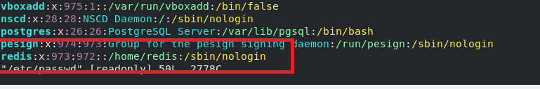

To install the latest version of Redis we need to download it and build it from source using the following commands:

```bash
# get the leatest version of redis
wget https://download.redis.io/redis-stable.tar.gz
tar -xvf redis-stable.tar.gz # extract the files
cd redis-stable
make BUILD_TLS=yes USE_SYSTEMD=yes
sudo make install
```

We need to copy the default configuration file from the source  directory **/etc/redis/redis.conf** like the following:

```bash
sudo mkdir -p /etc/redis
sudo cp redis.conf /etc/redis
sudo chown -R redis:redis /etc/redis
```

Now need to edit **redis.conf** to set the path for log file to **/var/log/redis-server.log** like the following:

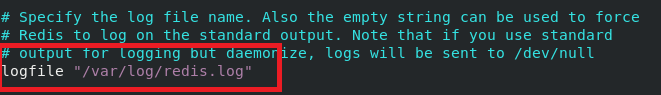

We need to create this log file and assign redis user as its owner using the following commands:

```bash
sudo touch /var/log/redis.log
sudo chown redis:redis /var/log/redis.log
sudo chmod 770 /var/log/redis.log
```

We set `supervisd` to **systemd** to allow managing redis as **systemd** service like the following:

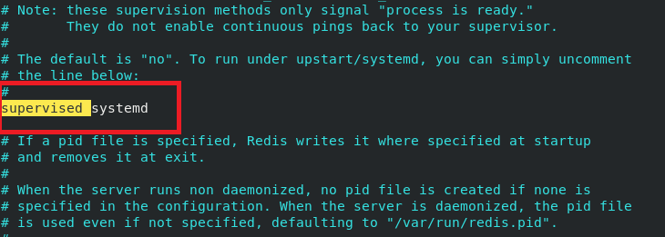
We need to change **dir** to a location where Redis will have write permissions and which isn't viewable by normal users. Use the **/var/lib/redis** directory for this like the following:

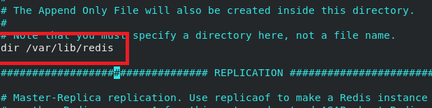

We need to create this directory and grant redis user permissions on it using the following commands:

```bash
sudo mkdir -p /var/lib/redis
sudo chown -R redis:redis /var/lib/redis
sudo chmod 770 /var/lib/redis
```

We need Redis server to run as a background service to do this we need to create a service file **redis.service** for Redis server like the following:

```service
# systemd service file for redis
[Unit]
Description=Redis In-Memory Data Store
After=network.target

[Service]
User=redis
Group=redis
ExecStart=/usr/local/bin/redis-server /etc/redis/redis.conf
ExecStop=/usr/local/bin/redis-cli shutdown
Restart=always

[Install]
WantedBy=multi-user.target
```

We need to move the **redis.service** file to the **/usr/lib/systemd/system** directory for systemd to be able to detect it as a service using the following command:

```bash
sudo mv redis.service /usr/lib/systemd/system/
```

Finally, we enable and start redis-server service using the following commands:

```bash
sudo systemctl enable redis-server.service
sudo systemctl start redis-server.service
sudo systemctl status redis-server.service
```

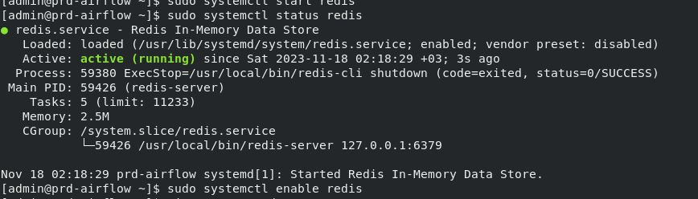

If we tail the log we find that the server has started successfully

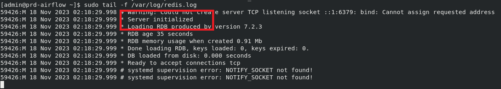

We can test that the server is running using it's command line utility `redis-cli` like the following:

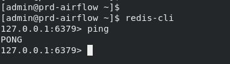

## Installing Airflow
To install Airflow we switch to airflow user like the following:

```bash
sudo su - airflowprd
cd /opt/Airflow
echo $AIRFLOW_HOME # make sure the variable is exported
```

the following pip install assumes the latest version of Airflow as of writing this document which is **2.7.3** using python 3.8 constraint file if you are running on a different version of airflow or python then please refer to [Airflow Documentation](https://airflow.apache.org/docs/apache-airflow/stable/installation/installing-from-pypi.html) for the proper pip install command

```bash
sudo pip3.8 install 'apache-airflow[jdbc,crypto,mssql,oracle,postgres,kerberos,ldap,redis,password,rabbitmq,ssh,hdfs,spark,celery]==2.7.3' --constraint "https://raw.githubusercontent.com/apache/airflow/constraints-2.7.3/constraints-3.8.txt" --user
```

Airflow works with providers for different features and connections. All providers are listed between the brackets in the previous command. we can divide them into the following:
1. **DB**: jdbc, mssql, oracle, postgres
2. **Bigdata**: RabbitMQ, hdfs, spark
3. **Security**: Kerberos, ldap, crypto, password
4. **Celery executer**: redis, celery
5. **Remote connection**: ssh

you can look up what each provider do and more providers in [Airflow Documentation](https://airflow.apache.org/docs/apache-airflow-providers/packages-ref.html).

Finally we need to generate Airflow configuration file in the $AIRFLOW_HOME directory using the following command:

```bash
airflow config list --defaults > "${AIRFLOW_HOME}/airflow.cfg"
```
## Configuring Airflow
Airflow configuration file should look like the following [Airflow Configuration File](./airflow.cfg)

After we finish this section
### Setting Up Database Connection
First we need to URL encode the database user password using python **urllib** like the following:

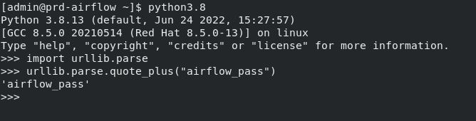

To setup database connection we need to modify **sql_alchemy_conn** value in **airflow.cfg** which follows the following format for PostgreSQL connection: **postgresql+psycopg2://\<user>:\<password>@\<host>/\<db>** like the following:

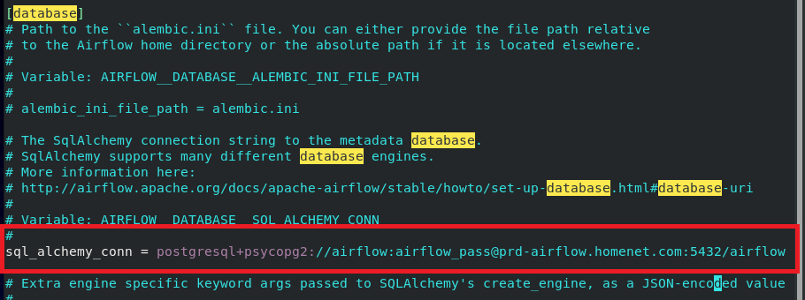

<span style="color: red;"><strong>Note:</strong> it's highly recommended to have the database hosted on a dedicated database server but for this tutorial we are hosting it on the same host.</span>

Now we initialize the database using the following command:

```bash
airflow db init
```

If everything is setup properly you should get a message that initialization is done.

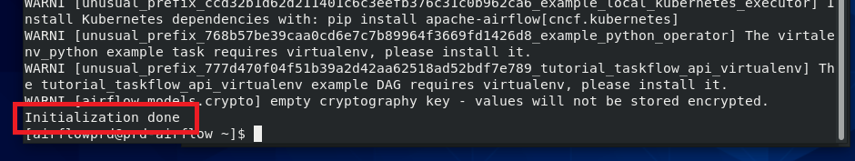

### Setting Up Airflow Directories
In the **airflow.cfg** we have configurations for the **dags** directory, **plugins** directory, and **logs** directory. It's recommended to have a dedicated logs partition for your applications but for this installation will be using **$AIRFLOW_HOME/logs** in the **logging** section

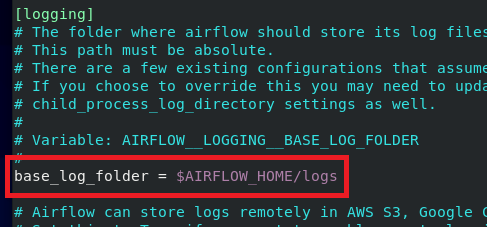

For dags directory we set it to **\$AIRFLOW_HOME/dags** it's also recommended to have a separate partition to store Airflow dags but for this installation will be using **\$AIRFLOW_HOME** store all Airflow data

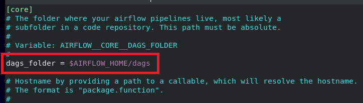

For **plugins** directory we set it to **\$AIRFLOW_HOME/plugins** in **core** configuration section like the following:

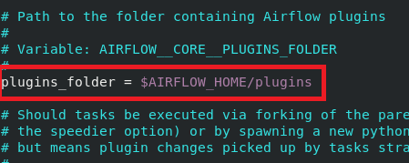

we will need to create directories for all the previous configurations using the following commands:

```bash
# you should be running these commands as airflowprd user
mkdir -p $AIRFLOW_HOME/logs
mkdir -p $AIRFLOW_HOME/dags
mkdir -p $AIRFLOW_HOME/plugins
```
### Setting Up Time Zone
The default Airflow time zone is **utc**. We will need to configure it to our time zone, to do this uncomment the **default_timezone** configuration in **core** configuration section and set it to the proper time zone like the following:

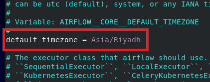

### Setting Up Celery Configuration
To setup celery executor first we need to assign celery as the default executor in the **core** configuration section like the following:

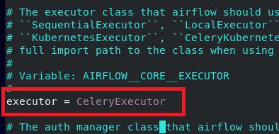

Now we need to configure celery to use redis database server as broker and airflow database backend in **airflow.cfg** by setting **broker_url** in the **celery** configuration section like the following:

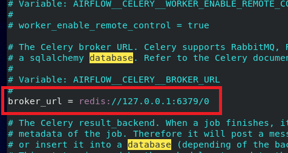

We also need to setup the **result_backend** configuration to airflow database like the following:

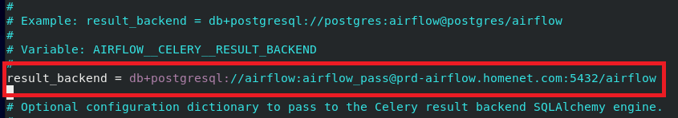

### Settings Up Core Configuration
we need to the **core** configuration section to the following settings:

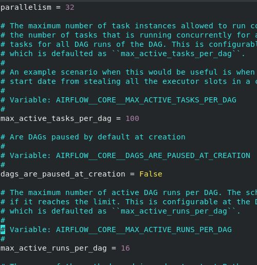

Disabling example dags

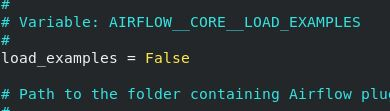

We set the following Dag variables to adjust import timeouts and import error messages

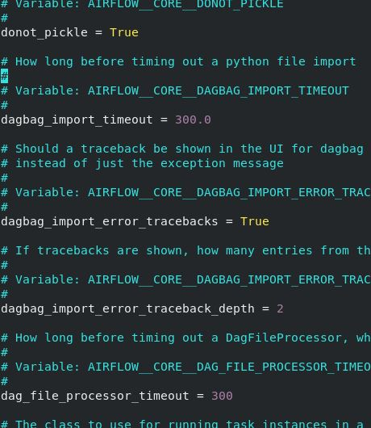

### Setting Up Kerberos Authentication
To setup Kerberos Authentication for airflow we need to copy **airflowprd.keytab** file to **\$AIRFLOW_HOME** using the following command:

```bash
# you should be running this command as airflowprd user
mv airflowprd.keytab $AIRFLOW_HOME/
```

We set the **security** configuration in the **core** configuration section in **airflow.cfg** to kerberos like the following:

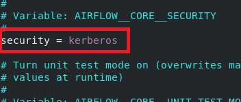

Then we set **kerberos** section in **airflow.cfg** to the following configuration:

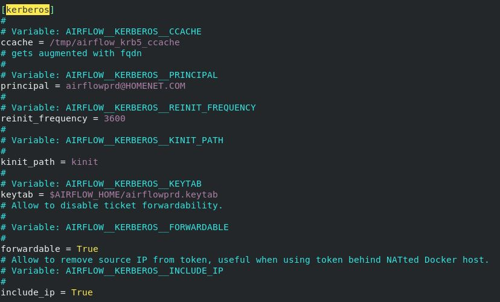

### Setting Up Fernet Key
To create a Fernet Key we run the following python script:

```python
from cryptography.fernet import Fernet
fernet_key = Fernet.generate_key()
print(fernet_key.decode())
```

like the following:

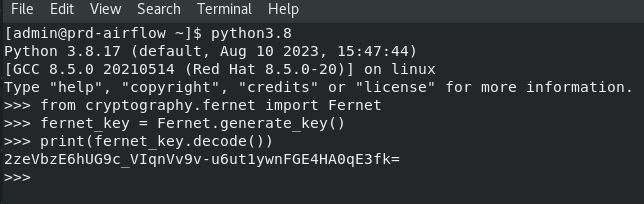

We copy the generated key and add to the **core** configuration section in **airflow.cfg** like the following:

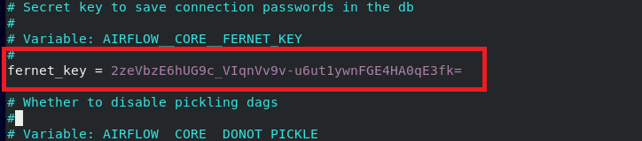

### Settings Up Airflow webserver Configuration
In the **webserver** section in **airflow.cfg** we need to set the following values:
- **config_file** = $AIRFLOW_HOME/webserver_config.py
- **base_url** = http://prd-airflow.homenet.com:8080
- **default_ui_timezone** = Asia/Riyadh
- **web_server_host** = prd-airflow.homenet.com
- **web_server_port** = 8080

like the following:

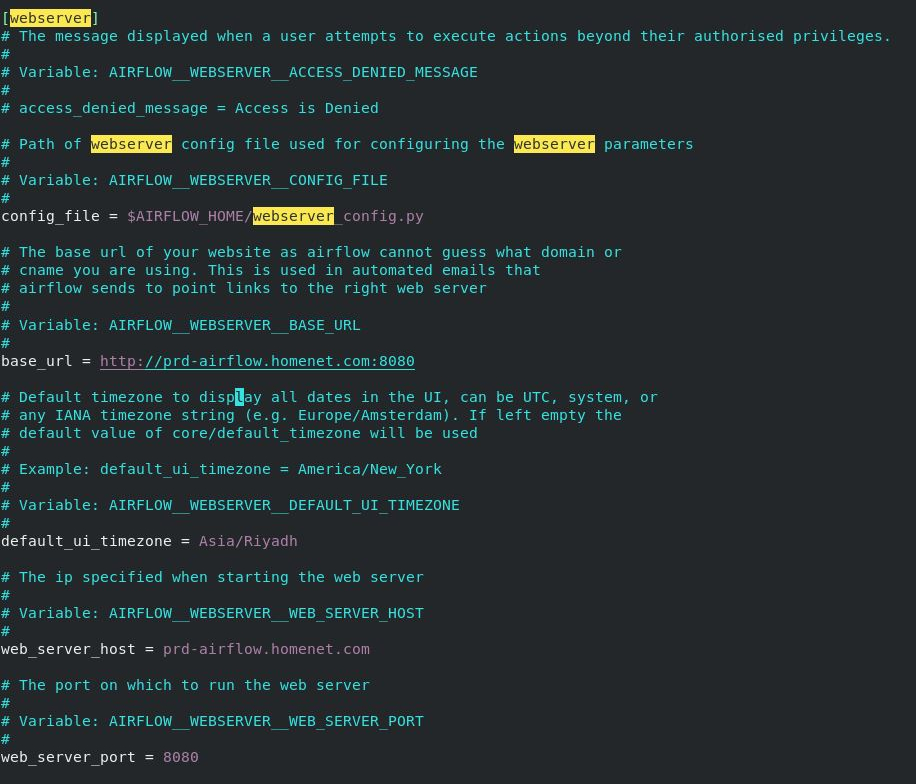

### Setting Up Web Server SSL
For this part we need the private key and SSL certificate for our host **prd-airflow.homenet.com**. For this installation we will assume that we have a private key ***prd-airflow.homenet.com-key.pem*** and an SSL certificate ***prd-airflow.homenet.com.pem***. First we need to move both files to **\$AIRFLOW_HOME** using the following commands:

```bash
# you should be running these commands as airflowprd user
mv prd-airflow.homenet.com-key.pem $AIRFLOW_HOME/
mv prd-airflow.homenet.com.pem $AIRFLOW_HOME/
```

In the **webserver** configuration section in **airflow.cfg** we need to set the following variables:
- **web_server_ssl_cert** = $AIRFLOW_HOME/prd-airflow.homenet.com.pem
- **web_server_ssl_key** = $AIRFLOW_HOME/prd-airflow.homnet.com-key.pem

like the following:

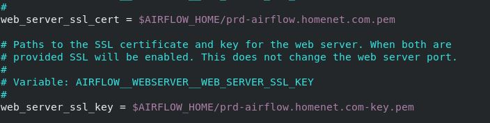

### LDAP Authentication for Web Server
To enable LDAP Authentication for Airflow webserver we need the following:
- **CA Root Certificate**: root.pem
- **SSL Certificate for host prd-airflow.homenet.com**: prd-airflow.homenet.com.pem
- **SSL Private Key for host prd-airflow.homenet.com**: prd-airflow.homenet.com-key.pem
- **Bind User**: we will be using the same domain user **airflowprd**
- Groups for Role mapping of which we have the following groups
	1. Admins groups: CN=Airflow Admins,OU=Users Groups,OU=All Users,DC=homenet,DC=com
	2. Operators groups: CN=Airflow Operators,OU=Users Groups,OU=All Users,DC=homenet,DC=com
	3. Users Group: CN=Airflow Users,OU=Users Groups,OU=All Users,DC=homenet,DC=com

now we can create a **webserver_config.py** file like the following:

```python
#
# Licensed to the Apache Software Foundation (ASF) under one
# or more contributor license agreements.  See the NOTICE file
# distributed with this work for additional information
# regarding copyright ownership.  The ASF licenses this file
# to you under the Apache License, Version 2.0 (the
# "License"); you may not use this file except in compliance
# with the License.  You may obtain a copy of the License at
#
#   http://www.apache.org/licenses/LICENSE-2.0
#
# Unless required by applicable law or agreed to in writing,
# software distributed under the License is distributed on an
# "AS IS" BASIS, WITHOUT WARRANTIES OR CONDITIONS OF ANY
# KIND, either express or implied.  See the License for the
# specific language governing permissions and limitations
# under the License.

"""Default configuration for the Airflow webserver."""
from __future__ import annotations
import os

from airflow.www.fab_security.manager import AUTH_LDAP

basedir = os.path.abspath(os.path.dirname(__file__))

# Flask-WTF flag for CSRF
WTF_CSRF_ENABLED = True
WTF_CSRF_TIME_LIMIT = None

# ----------------------------------------------------
# AUTHENTICATION CONFIG
# ----------------------------------------------------
# For details on how to set up each of the following authentication, see
# http://flask-appbuilder.readthedocs.io/en/latest/security.html# authentication-methods
# for details.

# The authentication type
AUTH_TYPE = AUTH_LDAP

# When using LDAP Auth, setup the ldap server
AUTH_LDAP_SERVER = "ldaps://dc1.homenet.com"
AUTH_LDAP_USE_TLS = False # use TLS should not be enabled when using ldaps

# setting user search filter memberOf (Airflow Admins || Airflow Operators || Airflow Users)
AUTH_LDAP_SEARCH_FILTER='|(memberOf=CN=Airflow Admins,OU=Users Groups,OU=All Users,DC=homenet,DC=com)(memberOf=CN=Airflow Operators,OU=Users Groups,OU=All Users,DC=homenet,DC=com)(memberOf=CN=Airflow Users,OU=Users Groups,OU=All Users,DC=homenet,DC=com)'

AUTH_LDAP_SEARCH = "OU=All Users,DC=homenet,DC=com"  # the LDAP search base
AUTH_LDAP_UID_FIELD = "sAMAccountName"  # the username field

# For a typical OpenLDAP setup (where LDAP searches require a special account):
# The user must be the LDAP USER as defined in LDAP_ADMIN_USERNAME
AUTH_LDAP_BIND_USER = "CN=airflowprd,OU=Services,OU=All Users,DC=homenet,DC=com"  # the special bind username for search
AUTH_LDAP_BIND_PASSWORD = "AIRFLOWPRD_USER_PASSWORD_GOES_HERE"  # the special bind password for search

AUTH_LDAP_TLS_CACERTFILE = '/opt/Airflow/root.pem'
AUTH_LDAP_TLS_CERTFILE = '/opt/Airflow/prd-airflow.homenet.com.pem'
AUTH_LDAP_TLS_KEYFILE = '/opt/Airflow/prd-airflow.homenet.com-key.pem'

AUTH_USER_REGISTRATION_ROLE = "Public"

# registration configs
AUTH_USER_REGISTRATION = True  # allow users who are not already in the FAB DB
AUTH_LDAP_FIRSTNAME_FIELD = "givenName"
AUTH_LDAP_LASTNAME_FIELD = "sn"
AUTH_LDAP_EMAIL_FIELD = "mail"  # if null in LDAP, email is set to:  {username}@email.notfound"

# a mapping from LDAP DN to a list of FAB roles
AUTH_ROLES_MAPPING = {
    "CN=Airflow Admins,OU=Users Groups,OU=All Users,DC=homenet,DC=com": ["Admin"],
    "CN=Airflow Operators,OU=Users Groups,OU=All Users,DC=homenet,DC=com": ["Op"],
    "CN=Airflow Users,OU=Users Groups,OU=All Users,DC=homenet,DC=com": ["User"]
}

# the LDAP user attribute which has their role DNs
AUTH_LDAP_GROUP_FIELD = "memberOf"

# if we should replace ALL the user's roles each login, or only on registration
AUTH_ROLES_SYNC_AT_LOGIN = True

# force users to re-auth after 30min of inactivity (to keep roles in sync)
PERMANENT_SESSION_LIFETIME = 1800
```

Finally we move **webserver_config.py** to **\$AIRFLOW_HOME** using the following command:

```bash
you should be running this command as airflowprd user
mv webserver_config.py $AIRFLOW_HOME/
```
## Create Local Users in Airflow

```bash
airflow users create --email student@example.com --firstname aStudent --lastname aStudent --password admin --role Admin --username admin
```
## Starting Airflow Services
To start Kerberos ticket renewer you can use the following command:

```bash
airflow kerberos -D -l $AIRFLOW_HOME/logs/airflow_ticket_renewer.log --stderr $AIRFLOW_HOME/logs/airflow_ticket_renewer.err --stdout $AIRFLOW_HOME/logs/airflow_ticket_renewer.out
```

To make sure ticket renewer is working with no issues we can tail the **stdout** file using the following command:

```bash
tail -f $AIRFLOW_HOME/logs/airflow_ticket_renewer.out
```

we should see an output similar to the following:

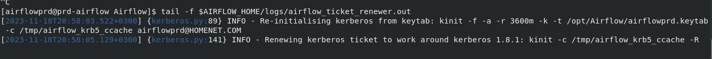

To start a celery worker you can use the following command:

```bash
airflow celery worker -D -l $AIRFLOW_HOME/logs/airflow_worker01.log --stdout $AIRFLOW_HOME/logs/airflow_worker01.out --stderr $AIRFLOW_HOME/logs/airflow_worker01.err
```

We can check that the worker is up and running by checking its **stdout** log like the following:

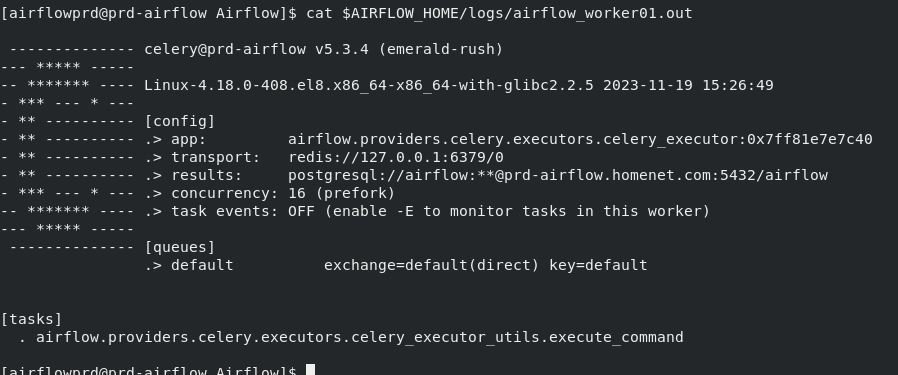

To start Airflow webserver you can use the following command:

```bash
airflow webserver -D -l $AIRFLOW_HOME/logs/airflow_webserver.log --stdout $AIRFLOW_HOME/logs/airflow_webserver.out --stderr $AIRFLOW_HOME/logs/airflow_webserver.err
```

If we open a web br.owser and go to https://prd-airflow.homenet.com we should get Airflow Login page like the following:

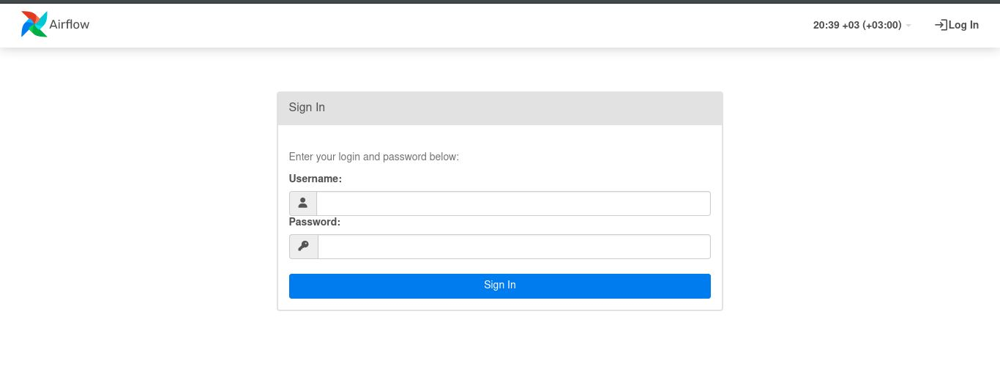

We can login with an admin user (any user that is a member of **Airflow Admins** group) then we should get Airflow dashboard page like the following:

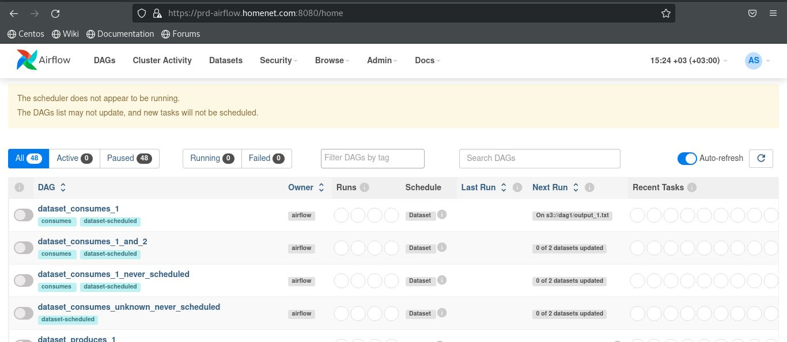

You can see a warning at the top of page saying that the scheduler is not working since we have not started the scheduler yet. To start Airflow scheduler you can use the following command:

```bash
airflow scheduler -D
```

Once the scheduler is up and running refresh the DAGs page. The warning message should disappear along with the example DAGs as we disabled the example DAGs in the **core** configuration section in **airflow.cfg**.

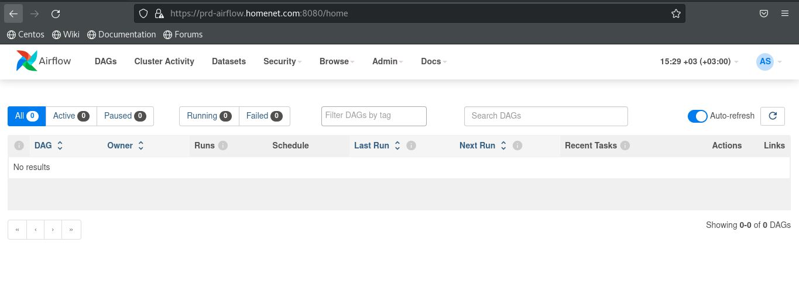