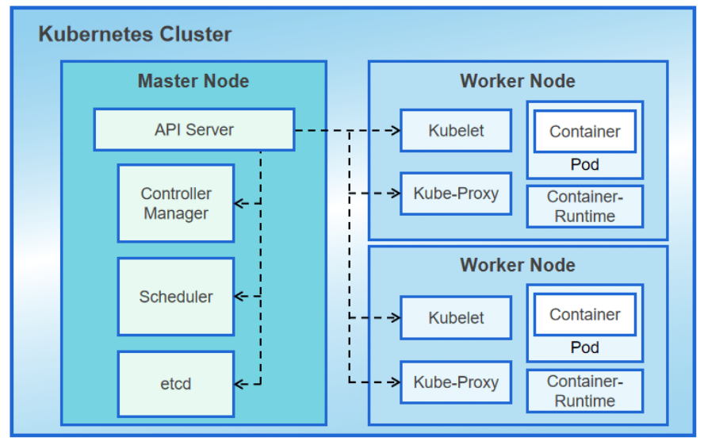

# 1. Introduction to Kubernetes

## What is Kubernetes?
Kubernetes (often abbreviated as **K8s**) is an open-source container orchestration platform that automates the deployment, scaling, and operation of containerized applications. It helps manage containers at scale, ensuring that applications run consistently and reliably across various environments (on-premise, cloud, hybrid).


**Key benefits of Kubernetes include:**
- **Automated container deployment and scaling**.
- **Self-healing**: It can automatically restart or replace failed containers.
- **Load balancing**: Distributes traffic to ensure high availability.
- **Storage orchestration**: Manages storage and persistent data.


## Kubernetes Architecture Overview
At a high level, Kubernetes follows a **declarative model**, where users declare the desired state of the system (e.g., “I want 5 instances of this application running”). Kubernetes continuously monitors and adjusts the system to match this desired state.

- **Cluster**: A Kubernetes cluster consists of a set of nodes (worker machines) managed by a control plane.
- **Nodes**: Worker machines that run containerized applications. Each node runs at least one container runtime (like Docker).
- **Pods**: The smallest deployable units in Kubernetes, which can host one or more containers.


## Core Components of Kubernetes
The Kubernetes architecture is divided into two main components: the **Control Plane** and the **Node Components**. Each of these plays a critical role in managing the cluster.

### 1.1 Control Plane
The Control Plane is responsible for managing the entire Kubernetes cluster. It makes global decisions, like scheduling workloads, and responds to changes (e.g., replacing failed Pods).

### 1.2 Node Components
Each **Node** in the Kubernetes cluster runs the necessary components to manage the individual Pods that host your application workloads. Nodes are the worker machines where containers are deployed.


# 2. Setting up Kubernetes

## Installation Methods

There are several ways to install and set up a Kubernetes cluster depending on your use case (development, production, or testing). Below are some common methods:

### 2.1 Minikube
- **Minikube** is a tool that lets you run Kubernetes locally. It creates a single-node Kubernetes cluster inside a virtual machine (VM) on your local machine.
- Ideal for testing and development.
  
  **Installation Steps**:
  1. Install Minikube from the official site: [Minikube Installation](https://minikube.sigs.k8s.io/docs/start/).
  2. Start Minikube:  
     ```bash
     minikube start
     ```
  3. Verify installation:  
     ```bash
     kubectl get nodes
     ```

### 2.2 kubeadm
- **kubeadm** is a tool designed to bootstrap a Kubernetes cluster easily. It sets up the control plane components and the worker nodes.
- Ideal for setting up production-ready Kubernetes clusters.

  **Installation Steps**:
  1. Install kubeadm, kubelet, and kubectl on your machines.
  2. Initialize the control plane:  
     ```bash
     sudo kubeadm init
     ```
  3. Set up the `kubeconfig` for the control plane node:  
     ```bash
     mkdir -p $HOME/.kube
     sudo cp -i /etc/kubernetes/admin.conf $HOME/.kube/config
     sudo chown $(id -u):$(id -g) $HOME/.kube/config
     ```
  4. Join worker nodes using the token generated by `kubeadm`.

### 2.3 Managed Kubernetes Services
- **Managed Kubernetes services** provide Kubernetes clusters as a service. Cloud providers manage the underlying infrastructure, and users can focus on deploying and managing workloads.

  **Popular Managed Kubernetes Platforms**:
  - **Google Kubernetes Engine (GKE)**
  - **Amazon Elastic Kubernetes Service (EKS)**
  - **Azure Kubernetes Service (AKS)**
  
  These services offer high availability, scalability, and integrated monitoring solutions.

## kubectl CLI Setup

`kubectl` is the command-line tool for interacting with Kubernetes clusters. You can use it to deploy applications, inspect and manage cluster resources, and view logs.

### 2.4 Installing kubectl
You can install `kubectl` on your local machine by following these steps:

- **On Linux**:
  ```bash
  curl -LO "https://dl.k8s.io/release/$(curl -L -s https://dl.k8s.io/release/stable.txt)/bin/linux/amd64/kubectl"
  chmod +x kubectl
  sudo mv kubectl /usr/local/bin/kubectl


# 3. Basic Kubernetes Concepts


## 3.1 Cluster and Nodes

### What is a Cluster?
A **Kubernetes cluster** consists of a set of worker machines, called **Nodes**, that run containerized applications. Every cluster has at least one **master** (or control plane), which manages the worker nodes and the Pods running on them.

### What are Nodes?
A **Node** is a worker machine (could be a physical or virtual machine) in a Kubernetes cluster. Each node runs the services necessary to manage the **Pods** and is managed by the control plane.

**Node Components:**
- **Kubelet**: Agent that ensures containers are running in Pods.
- **Kube-proxy**: Handles networking and load balancing for services.
- **Container Runtime**: Software that runs the containers (e.g., Docker, containerd).



## 3.2 Pods

### What are Pods?
A **Pod** is the smallest and simplest Kubernetes object. A Pod represents a single instance of a running process in your cluster and can contain one or more containers. Containers within a Pod share the same network and storage and are always scheduled together on the same Node.

### Pod Lifecycle
- **Pending**: The Pod has been accepted by the cluster, but one or more container images are still being created or downloaded.
- **Running**: The Pod has been scheduled on a Node and the containers are running.
- **Succeeded**: All containers in the Pod have successfully terminated.
- **Failed**: At least one container has failed.
- **Unknown**: The state of the Pod could not be determined.

## 3.3 Deployments

### What is a Deployment?
A **Deployment** is a higher-level abstraction responsible for managing a group of Pods (usually identical, replicated Pods). It defines how many replicas should run, allows for rolling updates, and ensures that Pods stay up and running.

### Deployment Features:
- **Scaling**: Adjust the number of Pods running.
- **Rolling Updates**: Gradually update applications without downtime.
- **Self-Healing**: Automatically replace failed Pods.

## 3.4 Services

### What are Services?
A **Service** in Kubernetes is an abstraction that defines a logical set of Pods and a policy by which to access them. Services enable networking and load balancing between Pods. A Service provides a stable IP address and DNS name to the Pods it manages, even as they are dynamically created and destroyed.

### Types of Services:
- **ClusterIP**: Exposes the Service on an internal IP within the cluster. (In order for different objects to be able to talk to each other) , An object with an attached clusterIP can be accessable. It has different ports : 
  - **port** : This is the port on the ClusterIP service itself, which is accessible within the cluster
  - **TargetPort** : This is the port on the Pod where the application is actually running    

- **NodePort**: is a type of Kubernetes service that exposes an application running in the cluster to the outside world. It opens a specific port on each Node (physical or virtual machine) in the cluster and forwards traffic from that port to the Pods that the service is targeting.
    - **port** : The port the Service exposes inside the cluster (e.g., 80)
    - **targetPort** : The actual port where the container inside the Pod is listening 
    - **nodePort** : The port on each Node where external traffic can access the service
    
    External traffic directed to <NodeIP>:<nodePort> is forwarded to the Service, which then forwards it to the targetPort on the Pod.

- **LoadBalancer**: Exposes the Service externally using a cloud provider’s load balancer.
- **ExternalName**: Maps the Service to the contents of an external DNS name.

## 3.5 Kubernetes Storage: PV, PVC, and Volumes

### 1. Persistent Volume (PV)
- **Purpose**: It represents physical storage like NFS, AWS EBS, or GCE Persistent Disks. PVs exist independently of any specific Pod and persist beyond the lifecycle of Pods.
- **Key Properties**:
  - **Capacity**: Defines the size of the volume.
  - **Access Modes**: How the volume can be accessed (`ReadWriteOnce`, `ReadOnlyMany`, `ReadWriteMany`).
  - **Reclaim Policy**: Defines what happens to the PV after a PVC is deleted (`Retain`, `Recycle`, `Delete`).

### 2.Persistent Volume Claim (PVC)

- **Definition**: A Persistent Volume Claim (PVC) is a request for storage by a user or a Pod. PVCs specify the size and access modes required, and Kubernetes binds the PVC to an available PV that meets the requested criteria.
  
- **Purpose**: PVCs abstract the storage request from the underlying storage system, allowing users to claim storage without needing to know the details of the physical storage.

- **Key Properties**:
  - **Size**: Specifies the storage size requested by the user.
  - **Access Modes**: The access pattern required (`ReadWriteOnce`, `ReadOnlyMany`, `ReadWriteMany`).
  
### 3. Volume (V)
- **Definition**: A Volume in Kubernetes is a directory accessible to containers in a Pod. It allows data to persist across container restarts within the same Pod.

- **Purpose**: Volumes enable Pods to share data between containers and ensure data persists during Pod restarts. However, Volumes are not persistent beyond the Pod lifecycle unless backed by a PV.

- **Types of Volumes**:
  - `emptyDir`, `hostPath`, `configMap`, `secret`, and `persistentVolumeClaim`.

### How They Work Together
- PV (Persistent Volume) is the actual storage resource provisioned in the cluster, representing the physical storage.

- PVC (Persistent Volume Claim) is a request for storage made by a Pod, which gets bound to a matching PV.

- Volume (V) is used within the Pod to mount the claimed storage from the PVC, allowing containers to access the persistent storage.


## 3.6 Environment Variables in Kubernetes

### What are Environment Variables?
Environment variables in Kubernetes are key-value pairs that are passed into containers to configure how an application behaves. These variables allow you to supply dynamic configuration data, credentials, and other information to containers at runtime without hardcoding them into container images.

### Purpose of Environment Variables
- **Configuration**: They help configure applications without modifying the source code.
- **Secrets Management**: Environment variables can be used to inject sensitive information such as passwords or API tokens.
- **Dynamic Behavior**: They allow containers to adjust their behavior based on the environment (e.g., staging vs. production)
.
### Ways to Define Environment Variables in Kubernetes

#### 1. **Static Values in Pod Specification**
You can directly specify static environment variables in the Pod specification (config file).

#### 2. **Secrets**
Kubernetes Secrets are used to inject sensitive information like passwords and API keys into a container as environment variables.


## 3.7 NGINX Ingress
### Purpose 
When you expose services in Kubernetes, they are typically accessible only within the cluster (via ClusterIP) or can be exposed via external IPs (NodePort or LoadBalancer). However, these methods don’t offer robust routing features, like path-based routing, SSL termination, and load balancing, which is where Ingress comes into play.

NGINX Ingress Controller acts as the entry point (gateway) that intelligently routes external requests to services within your Kubernetes cluster based on Ingress rules.

